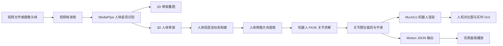
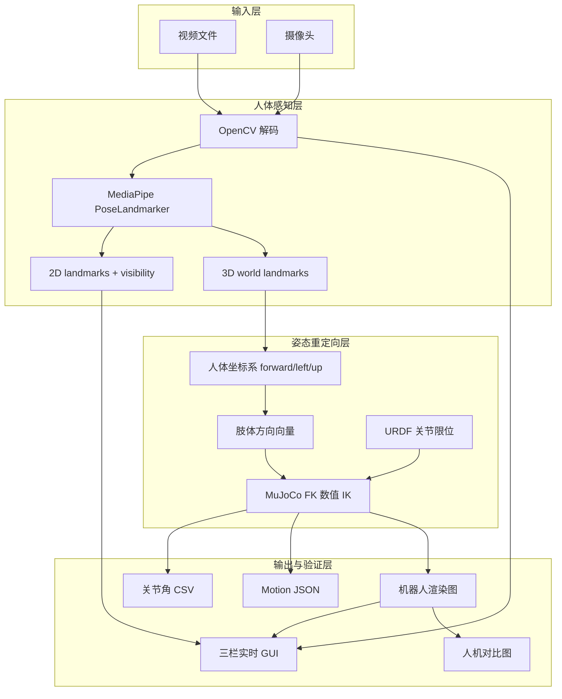
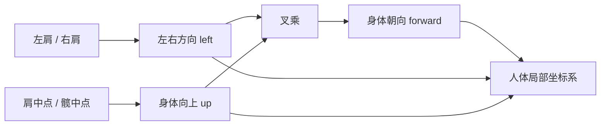
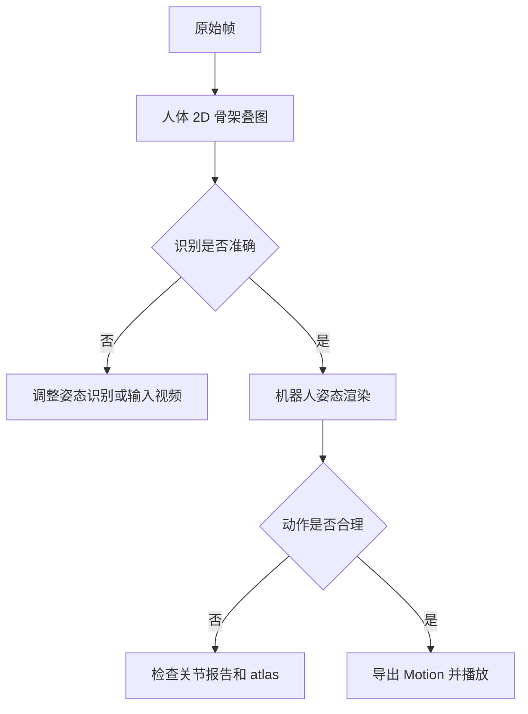

# 视频人体姿态到灵龙机器人姿态映射技术文档

版本: v2 工程验证版  
日期: 2026-08-16  
适用对象: 算法工程、机器人仿真、动作生成与演示系统集成

---

## 1. 概述

本方案实现了一条从真人视频或摄像头画面到灵龙机器人姿态的工程化验证流水线。系统以视频帧为输入,通过人体姿态识别获得 2D/3D 人体骨架,再将人体骨架方向重定向到机器人运动链,最终输出机器人关节角、MuJoCo 渲染图和可播放的 Motion JSON。

当前版本的目标是建立一套“可观察、可验证、可迭代”的动作映射系统。它不仅输出最终机器人动作,也保留关键中间状态,用于定位问题到底来自人体识别、坐标转换、关节映射、限位约束还是渲染展示。

---

## 2. 系统流水线



流水线分为五个阶段:

1. 输入采集: 从视频文件或摄像头读取图像帧。
2. 人体感知: 识别每帧人体 2D/3D 关键点。
3. 姿态重定向: 将人体骨架方向转换为机器人目标方向。
4. 机器人求解: 基于机器人 URDF 和 MuJoCo FK 求解关节角。
5. 可视化验证: 渲染输入帧、姿态叠图、机器人图像和动作文件。

---

## 3. 技术架构



技术选型:

| 层级 | 技术 | 作用 |
|---|---|---|
| 视频处理 | OpenCV | 读取视频、摄像头、帧图像处理 |
| 人体识别 | MediaPipe PoseLandmarker | 输出 33 点 2D/3D 人体姿态 |
| 数值计算 | NumPy | 坐标系、向量、角度和优化计算 |
| 机器人模型 | URDF | 描述机器人 link、joint、axis、limit |
| 运动学与渲染 | MuJoCo | 读取 URDF、执行 FK、离屏渲染机器人 |
| 可视化界面 | PyQt5 | 实时三栏 GUI |

---

## 4. 人体姿态识别

人体姿态识别使用 MediaPipe PoseLandmarker。每帧图像会输出 33 个人体关键点,其中同时包含图像坐标和世界坐标。

识别结果包含两类数据:

| 数据 | 说明 | 用途 |
|---|---|---|
| 2D landmark | 归一化图像坐标和可见度 | 绘制人体骨架叠图,判断识别是否准确 |
| 3D world landmark | MediaPipe 估计的人体三维坐标 | 构建人体骨架方向,用于机器人映射 |

该阶段的主要验证方式是把 2D 骨架直接画回原图。若 2D 骨架没有贴合人体,说明问题在识别阶段；若 2D 骨架正确但机器人姿态错误,则问题应集中在后续重定向和关节求解。

---

## 5. 人体坐标系构建

人体 3D 关键点本身不能直接映射到机器人关节,因为人体坐标系、相机坐标系和机器人坐标系并不天然一致。系统会先根据人体肩部和髋部构建一个局部坐标系。



坐标系定义:

| 轴 | 来源 | 含义 |
|---|---|---|
| `left` | 左肩到右肩方向的反向 | 人体左右方向 |
| `up` | 髋中点到肩中点 | 身体竖直方向 |
| `forward` | `left` 与 `up` 的叉乘 | 身体朝向 |

所有肢体方向会先投影到该人体局部坐标系,再转换为机器人目标方向。这一步用于削弱相机视角、人体朝向和画面左右镜像对关节映射的影响。

---

## 6. 机器人姿态重定向

### 6.1 重定向目标

系统当前不直接拟合人体关键点的绝对位置,而是拟合肢体方向。原因是灵龙机器人没有 floating base,无法表达人体在画面中的整体平移、走路位移或跳跃高度。如果强行拟合绝对位置,会导致下半身和躯干出现大量不自然动作。

当前拟合目标:

| 人体链条 | 机器人链条 | 拟合内容 |
|---|---|---|
| 肩 -> 肘 | 肩 -> 肘 | 上臂方向 |
| 肘 -> 腕 | 肘 -> 腕 | 前臂方向 |
| 髋 -> 膝 | 髋 -> 膝 | 大腿方向 |
| 膝 -> 踝 | 膝 -> 踝 | 小腿方向 |
| 踝 -> 脚尖 | 踝 -> 脚部 | 脚部方向 |

### 6.2 为什么采用 FK 数值 IK

早期方案曾尝试按照关节名直接写公式,例如根据 `shoulder_pitch`、`shoulder_roll` 推断肩部角度。这类方法问题很大,因为机器人关节的真实正方向取决于 URDF 中的 `axis`、`origin`、`parent/child` 链条,而不是关节名本身。

当前默认方案改为基于 MuJoCo 正运动学的数值 IK:

1. 给定一组机器人关节角。
2. 使用 MuJoCo 计算机器人 link 的真实空间位置。
3. 得到机器人上臂、前臂、大腿、小腿等方向向量。
4. 将这些向量与人体目标方向比较,计算误差。
5. 逐步搜索关节角,找到误差更小的姿态。
6. 每次搜索都遵守 URDF 中的真实关节限位。

该方法的优点是直接依赖机器人模型本身,避免手写错误的轴向假设。

### 6.3 当前参与求解的关节

当前默认 IK 输出 24 个主要关节:

| 部位 | 关节 |
|---|---|
| 左腿 | 髋 pitch/roll/yaw, 膝, 踝 pitch/roll |
| 右腿 | 髋 pitch/roll/yaw, 膝, 踝 pitch/roll |
| 腰部 | yaw, pitch |
| 头部 | yaw, pitch |
| 左臂 | 肩 pitch/roll/yaw, 肘 |
| 右臂 | 肩 pitch/roll/yaw, 肘 |

暂未映射 wrist 三轴。原因是单独的手腕点只能描述位置,不能稳定描述手掌朝向；如果没有手部关键点,手腕旋转会高度不确定。

---

## 7. 关节限位与质量报告

所有机器人关节角都以 URDF 中的真实 limit 为准。映射完成后会生成关节角 CSV 和质量报告。

质量报告主要关注:

| 指标 | 含义 |
|---|---|
| `min` / `max` | 当前视频中该关节的角度范围 |
| `mean` | 该关节平均角度 |
| `limit_hits` | 贴近关节限位的帧数 |

`limit_hits` 是定位映射问题的关键指标。如果某个关节大量贴限位,通常说明:

- 人体坐标系方向可能反了。
- 左右肢体映射可能错位。
- 对应关节不该承担当前动作分量。
- IK 目标权重或约束设计不合理。
- 机器人本体自由度不足以表达该人体动作。

当前已观察到下肢映射中髋 yaw 和膝盖存在较多限位命中,这是下一步校准重点。

---

## 8. 可视化验证设计

系统设计的核心原则是: 每一个关键阶段都必须可视化。



可视化产物:

| 产物 | 作用 |
|---|---|
| 输入抽帧 | 判断视频内容、方向、人体是否完整 |
| 2D 姿态叠图 | 判断 MediaPipe 是否识别正确 |
| 3D 三视图 | 判断 MediaPipe 3D 是否发生翻转或跳变 |
| 机器人渲染图 | 判断单帧机器人姿态是否合理 |
| 人机对比图 | 判断时间对齐和动作语义是否一致 |
| 关节 atlas | 判断机器人关节正负方向和视觉效果 |

---

## 9. 实时三栏 GUI

实时 GUI 用于在线观察完整链路。界面固定为三栏:

| 区域 | 内容 |
|---|---|
| 左侧 | 当前视频帧或摄像头帧 |
| 中间 | 当前帧实时计算的人体姿态叠图 |
| 右侧 | 当前帧映射后的机器人 MuJoCo 渲染 |

底部数据面板显示:

| 数据 | 说明 |
|---|---|
| 输入源 | 当前视频路径或摄像头编号 |
| 帧信息 | 当前帧号、时间、FPS |
| 处理耗时 | 单帧识别、映射和渲染耗时 |
| 可见度 | MediaPipe 平均 visibility |
| 关节角 | 当前机器人输出关节角 |

实时 GUI 的定位不是最终产品界面,而是调试和验收工具。它可以快速判断一帧异常来自识别、映射还是渲染。

启动视频模式:

```bash
.venv\Scripts\python.exe -m pose2robot.cli gui --source D:\Downloads\RGB视频数据集.mp4
```

启动摄像头模式:

```bash
.venv\Scripts\python.exe -m pose2robot.cli gui --source 0
```

---

## 10. 离线处理流程

离线模式用于生成完整可交付产物,适合对一段视频做批处理验证。

### 10.1 一键执行

```bash
.venv\Scripts\python.exe -m pose2robot.cli run-all D:\Downloads\RGB视频数据集.mp4 --name demo_motion --method ik
```

该命令会完成:

1. 读取视频信息。
2. 抽取关键帧。
3. 识别人体 2D/3D 姿态。
4. 渲染人体姿态图。
5. 执行机器人 IK 映射。
6. 生成关节 CSV 和质量报告。
7. 生成 Motion JSON。
8. 渲染机器人姿态图。
9. 生成人体与机器人对比图。
10. 导出可被仿真面板加载的动作文件。

### 10.2 分步执行

当需要定位问题时,建议分步执行:

```bash
.venv\Scripts\python.exe -m pose2robot.cli video-info D:\Downloads\RGB视频数据集.mp4
.venv\Scripts\python.exe -m pose2robot.cli sample-frames D:\Downloads\RGB视频数据集.mp4 -n 8
.venv\Scripts\python.exe -m pose2robot.cli detect-pose D:\Downloads\RGB视频数据集.mp4 --name demo_motion
.venv\Scripts\python.exe -m pose2robot.cli visualize-pose out\v2\demo_motion\pose.json -n 12
.venv\Scripts\python.exe -m pose2robot.cli map-robot out\v2\demo_motion\pose.json --name demo_motion --method ik --render --export-panel
.venv\Scripts\python.exe -m pose2robot.cli compare out\v2\demo_motion\pose.json out\v2\demo_motion\robot\motion.json -n 12
.venv\Scripts\python.exe -m pose2robot.cli check-motion out\v2\demo_motion\robot\motion.json
```

---

## 11. Motion 输出与仿真播放

系统输出的 Motion JSON 是关键帧格式。每个关键帧包含时间戳和一组机器人关节角。

Motion 可用于:

- 在 MuJoCo 渲染中复现机器人姿态。
- 在仿真面板中播放动作。
- 作为后续控制器、动作库或数据集的中间格式。

Motion 合规检查包括:

| 检查项 | 说明 |
|---|---|
| 关节名合法 | 每个输出关节必须存在于 URDF |
| 时间合法 | 关键帧时间必须单调 |
| 数值合法 | 不允许 NaN 或 Inf |
| 限位合法 | 不允许超出 URDF 关节范围 |

---

## 12. 关节 atlas 校准

关节 atlas 是当前系统中最重要的校准工具之一。它会对机器人主要关节分别设置正向和负向角度,并渲染成图片。

生成命令:

```bash
.venv\Scripts\python.exe -m pose2robot.cli joint-atlas
```

使用方式:

1. 先看零位图,确认机器人默认姿态。
2. 对比每个关节的正向图和负向图。
3. 记录每个关节正负方向在视觉上的真实含义。
4. 将这些结论反馈到 IK 目标、坐标系符号和约束设计中。

该方法比阅读关节名更可靠,因为 URDF 的 axis 和 link 安装方向才决定真实运动。

---

## 13. 当前边界

当前系统已经具备端到端验证能力,但仍是工程验证版,不是最终高质量动作生成系统。

主要边界:

| 边界 | 影响 |
|---|---|
| 无 floating base | 无法表达人体整体平移、走路位移、跳跃高度 |
| 单目 3D 不稳定 | 侧身、遮挡、快速动作时可能产生深度跳变 |
| 下肢 IK 尚需校准 | 髋 yaw、膝盖在部分动作中容易贴限位 |
| wrist 未映射 | 手掌朝向无法复现 |
| 数值 IK 速度有限 | 实时模式存在计算开销 |
| 缺少动力学约束 | 当前只做运动学姿态,不保证真实机器人平衡 |

这些边界不会阻止工程验证,但会影响动作质量。后续优化应优先围绕关节方向校准、下肢约束和时间平滑展开。

---

## 14. 验收标准

### 14.1 功能验收

| 项目 | 标准 |
|---|---|
| 视频输入 | 能读取视频并逐帧处理 |
| 摄像头输入 | 能打开摄像头并实时刷新 |
| 人体识别 | 中间图能显示人体 2D 骨架 |
| 机器人输出 | 右侧能显示完整机器人渲染 |
| Motion 导出 | 能生成可校验的 Motion JSON |
| 仿真播放 | 导出的动作能进入仿真面板播放 |

### 14.2 工程验收

| 项目 | 标准 |
|---|---|
| 可观察 | 输入、中间、输出都有图像证据 |
| 可定位 | 能区分识别问题和映射问题 |
| 可复跑 | 命令行可重复生成同类产物 |
| 可检查 | 有 CSV、报告和 Motion 合规检查 |
| 可扩展 | IK、渲染、识别、GUI 模块分离 |

---

## 15. 后续优化建议

建议按以下顺序推进:

1. 完成下肢关节 atlas 校准,重点处理髋 yaw 和膝盖限位命中。
2. 为腿部 IK 加入人体步态约束,避免把平移运动错误映射成髋 yaw。
3. 增加 visibility 低置信帧处理,使用上一帧保持或插值。
4. 增加角速度和角加速度限制,降低机器人动作抖动。
5. 引入手部关键点模型,补齐 wrist 旋转映射。
6. 将数值 IK 优化为 Jacobian IK 或解析近似,提升实时性能。
7. 如果需要走路和跳跃,引入 floating base 模型或单独设计 base motion。

---

## 16. 交付结论

当前 v2 系统已经形成完整闭环:

```text
输入帧 -> 人体姿态 -> 机器人 IK -> 机器人渲染 -> Motion 输出 -> 仿真播放
```

它具备以下交付能力:

- 支持视频和摄像头输入。
- 支持人体 2D/3D 姿态识别。
- 支持基于 URDF/MuJoCo 的机器人姿态映射。
- 支持全身主要关节输出。
- 支持实时三栏 GUI 验证。
- 支持离线批处理和中间产物保存。
- 支持 Motion JSON 导出和合规检查。

下一阶段工作的重点不是重建链路,而是在现有验证闭环上持续校准关节映射,尤其是下肢关节方向、限位约束和时间平滑。
